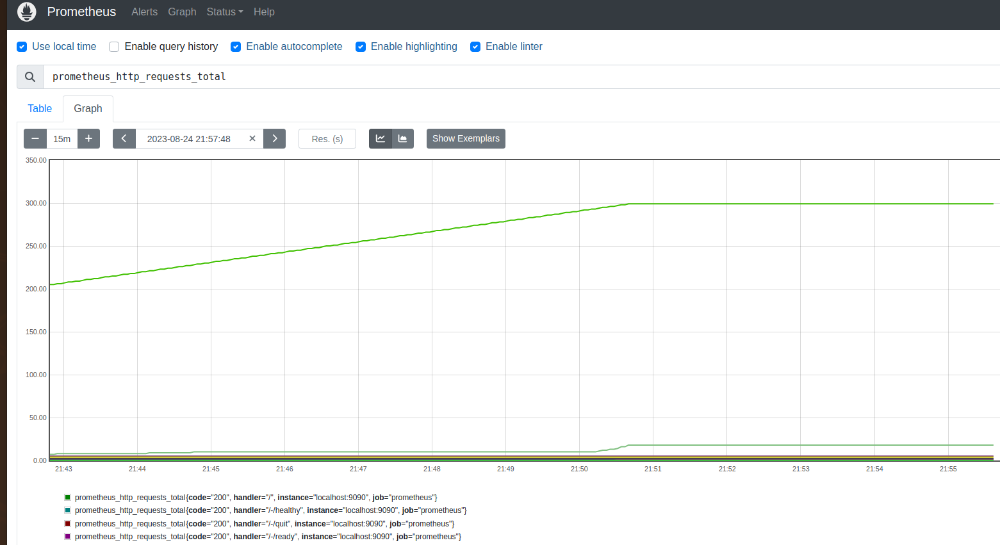

<h2 align="center">Prática 02</h2>

### Objetivo da prática
<p align="justify">Verifique as aplicações que possuem a mesma funcionalidade/ou quase, fazendo um breve resumo sobre cada um deles e se possível com vantagens e desvantagens. Escolha um deles e faça a instalação e configuração para poder compará-lo ao Zabbix (Prática 01).</p>

### Nagios
<p align="justify">É uma das ferramentas de monitoramento de código aberto mais antigas e amplamente utilizadas. Ele oferece monitoramento de sistemas, redes, infraestrutura e serviços, além disso oferece alertas para servidores, switches, aplicativos e serviços. 
O Nagios é altamente personalizável e suporta plugins para estender suas funcionalidades, sendo originalmente projetado para rodar sob Linux, mas também roda em outras variantes Unix. É software livre licenciado sob os termos da GNU General Public License versão 2 conforme publicado pela Free Software Foundation.

- Vantagens: Experiência estabelecida, grande comunidade de usuários, extensível através de plugins, suporte a SNMP.<br>

- Desvantagens: Interface de usuário menos moderna, configuração inicial mais complexa, escala limitada para grandes ambientes.</p>

### Prometheus
<p align="justify">Ferramenta de monitoramento de código aberto desenvolvida para ambientes de nuvem e sistemas distribuídos. Ele utiliza a coleta de métricas por meio de "scraping" (coleta) e suporta armazenamento e consulta de séries temporais. Dentre as principais características, podemos citar: um modelo de dados multidimensional com dados de séries temporais identificados por nome de métrica e pares chave/valor, coleta de séries temporais acontece por meio de um modelo pull sobre HTTP e dispõe de vários modos de suporte a gráficos e painéis.

- Vantagens: Modelagem de dados flexível, suporte a sistemas altamente dinâmicos, armazenamento eficiente de séries temporais.<br>

- Desvantagens: Configuração inicial mais complexa, pode exigir uma curva de aprendizado para consultas avançadas, interface menos orientada a gráficos comparada ao Zabbix.</p>

### Icinga
<p align="justify">Foi originalmente criado como um fork do aplicativo de monitoramento do sistema Nagios em 2009, sendo desenvolvido para resolver algumas das limitações percebidas do Nagios. Ele oferece monitoramento de rede e sistemas, além de ser altamente configurável. Devido à sua natureza como um fork, o Icinga oferece os recursos do Nagios com algumas adições, como módulo de relatório opcional com precisão de SLA aprimorada, conectores de banco de dados adicionais para PostgreSQL e Oracle e sistemas distribuídos para monitoramento redundante. O Icinga também mantém a configuração e compatibilidade de plug-in com o Nagios, facilitando a migração entre os dois softwares de monitoramento.

- Vantagens: Melhoria em relação ao Nagios, suporte a plugins, escalabilidade, visualizações de status em tempo real.<br>

- Desvantagens: Ainda compartilha algumas complexidades do Nagios, pode exigir configuração detalhada.</p>

### Cacti
<p align="justify">Ferramenta de monitoramento de código aberto que se concentra na geração de gráficos e visualizações de dados relacionados ao desempenho de rede e sistemas. Ele utiliza o protocolo SNMP para coletar métricas de dispositivos de rede e sistemas, e é amplamente usado para monitorar a utilização de largura de banda, tráfego de rede e outros indicadores de desempenho.

- Vantagens: O Cacti permite criar gráficos altamente personalizáveis que podem mostrar informações detalhadas de desempenho, é possível monitorar dispositivos de rede, como roteadores e switches, através do protocolo SNMP, permite agendar a coleta de dados em intervalos específicos para gerar gráficos precisos ao longo do tempo, possui uma comunidade ativa de usuários e desenvolvedores. <br>

- Desvantagens: Embora o Cacti possa exibir dados em gráficos, seu foco principal está nas visualizações gerais, com menos ênfase em alertas e monitoramento ativo, a configuração inicial do Cacti pode ser complexa, especialmente para usuários novos devido à necessidade de configurar os dispositivos e as fontes de dados corretamente.</p>

<hr>

### Instalação e configuração do Prometheus
O Prometheus foi escolhido para ser instalado e configurado, então há dois diretórios de configuração. O primeiro de nome "prometheusitself" contém um arquivo prometheus.yml cuja configuração é para monitorar o próprio Prometheus. O segundo diretório de nome "prometheuslinuxmint" contém um outro arquivo prometheus.yml com a configuração para monitorar uma VM Linux Mint, e neste diretório há o arquivo docker-compose.yml que contém a configuração para subir os containers prometheus-itself e prometheus-linuxmint.


### Execução do docker-compose
```bash
$ docker-compose up -d
```

### Acesso ao Prometheus itself
```bash
http://localhost:9090
```

Obs.: Para monitora o Host Linux Mint (ou outro que desejar) é necessário que o node_exporter esteja sendo executando no Host. Para isso, envie e execute o script "node_exporter.sh" que está no diretório "node_exporter-1.6.1.linux-amd64". 
### Execução do node_exporter
```bash
$ ./node_exporter.sh
```

### Acesso ao Prometheus para monitorar o Host Linux Mint
```bash
http://localhost:9092
```

### Registros

- <p>Monitoramento Itself Prometheus</p>


- <p>Monitoramento do Host Linux Mint</p>

