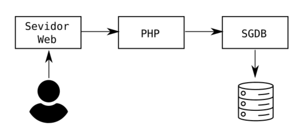

<h2 align="center">Prática 03 - Troubleshooting Zabbix</h2>

Passos para a prática de Troubleshooting Zabbix:

- cd dkf/
- sudo docker build -t ng-zbagt .
- cd ..
- sudo docker-compose up -d
- sudo cp nginx/default.conf /srv/volumes/nginx/conf.d
- sudo cp nginx/html/index.html /srv/volumes/nginx/html/
- sudo cp php/database.php php/index.php php/t.php /srv/volumes/php/
- sudo docker exec -it zabbix-mariadb mysql -uroot -p
- CREATE DATABASE pratica03;
- sudo docker exec php docker-php-ext-install mysqli
- sudo docker restart nginx php

Testes no Browser:

- localhost
- localhost/index.php
- localhost/database.php

### Integração do Nginx com o Zabbix:

