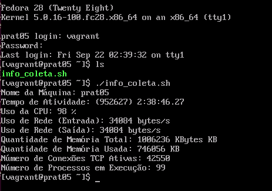

<h2 align="center">Prática 05 - SNMP + Python + Linux</h2>

1- Instale (OU pegue já instalada) uma máquina virtual de alguma distribuição baseada em Red Hat. Se possível, instale-a sem interface gráfica.

2- Instale o servidor SNMP nesta máquina e faça sua configuração inicial (Comunidade RO)

3- Teste o acesso SNMP a esta máquina usando os comandos snmpget e snmpwalk.
1.3.6.1.2.1.1.5 <--- sysName.0

4- Escreva um script Python ou Bash que colete e exiba o máximo de informações sobre este servidor usando snmp.

Exemplos de informações (mas você deve obter mais informações):

Nome da Máquina
Uptime
Uso da CPU
Uso da Rede
Quantidade de Memória
…

As informações devem ser exibidas de modo inteligível, i.e. De modo que o usuário que não está familiarizado com SNMP consiga entender.

<hr>

### Vagrant
Através do arquivo Vagrantfile foi instanciado uma vm com o sistema operacional Fedora 28, sendo usado o provider libvirt, e nela foi realizada a instalação de todas as dependências necessárias do protocolo SNMP, bem como a configuração do mesmo conforme solicitado. Para subir a máquina virtual, execute o comando abaixo. 

Atenção: é necessário ter todas as dependências do libvirt instaladas na máquina, bem como o plugin vagrant-libvirt. Para isso, siga as instruções abaixo:

```bash
$ sudo apt update -y && sudo apt upgrade -y && sudo apt install vagrant ruby-libvirt qemu qemu-kvm virtinst libvirt-daemon-system libvirt-daemon libvirt-clients bridge-utils ebtables dnsmasq-base libxslt-dev libxml2-dev libvirt-dev zlib1g-dev ruby-dev libguestfs-tools -y && vagrant plugin install vagrant-libvirt
```
Em seguida, execute o comando abaixo para subir a máquina virtual:

```bash
$ cd Vagrant
$ vagrant up
# Caso apareça o erro de "storage pool", execute o "$ virsh pool-list --all" para verificar o nome do pool desejado e substitua no vagrantfile em "libvirt.storage_pool_name=". Em seguida, execute o "$ vagrant up" novamente.
```

Após a VM ser provisionada, é possível acessá-la através do comando:

```bash
vagrant ssh
```

Realize os procedimentos a seguir:

```bash
$ sudo yum apt update -y
$ sudo yum upgrade -y
$ sudo yum install net-snmp net-snmp-utils nano -y
$ sudo yum nano /etc/snmp/snmpd.conf
# Adicione o parâmetro "rocommunity pratc05" no arquivo snmpd.conf
$ sudo systemctl restart snmpd
$ snmpget -v 2c -c pratc05 localhost 1.3.6.1.2.1.1.5.0
```

Nesse momento o servidor SNMP já está configurado e pronto para ser utilizado. Copie o script Vagrant/info_col.sh para a máquina virtual e execute-o. Com isso será exibida as informações solicitadas na prática.

```bash
$ chmod +x info_col.sh
$ sudo ./info_col.sh
```

<p>Saída do script info_col.sh</p>

 
