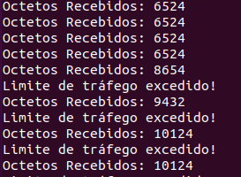

<h1 align="center">Prática 06 - SNMPv3 e Python</h1>

## 1. Autenticação e Privacidade no SNMPv3

Um dos principais avanços do SNMPv3 em relação às versões anteriores foi a inclusão de mecanismos de segurança, para aprimorar o controle de acesso às informações dos dispositivos gerenciados, bem como prover privacidade das informações trocadas entre o agente e a entidade gerenciadora. Nas versões 1 e 2 do SNMP, o controle de acesso é feito por meio de uma string de comunidade, que é transmitida sem criptografia.

### 1.1 Usuários SNMPv3

Uma parte importante do uso do SNMPv3 é o gerenciamento de usuários. É por meio da criação de usuários que pode-se utilizar as funcionalidades de autenticação e privacidade disponíveis no protocolo. O paradigma mais difundido para segurança no SNMPv3 é denominado de User Security Module (USM). Por meio desse modelo, usuários podem ser definidos, e é definido de que forma os usuários podem se autenticar e realizar consultas a um agente. Portanto, o agente armazena as informações sobre os usuários que possuem acesso a ele, e a entidade gerenciadora deve conhecer as informações sobre usuários cadastrados no agente para que consiga realizar o acesso aos objetos gerenciados do agente.

### 1.2 Níveis de Segurança dos Usuários

No SNMPv3, são definidos três níveis de segurança, são eles:

unauthenticated (também chamado noAuthNoPriv ou noauth): não usa criptografia nem autenticação (similar às versões mais antigas do SNMP);
authenticated (também chamado authNoPriv ou auth): adiciona um hash para permitir identificar possíveis alterações no pacote e também realizar autenticação. A senha do usuário é usada para criar o hash;
private (também chamado authPriv ou priv): utiliza criptografia nos pacotes trafegados. Apenas o nome de usuário é enviado em texto plano. Dessa forma, esse modo exige autenticação (usuário e senha) e provê privacidade.
Diferentes algoritmos podem ser utilizados para cálculo do hash (por exemplo, MD5 ou SHA), bem como para criptografar as mensagens (por exemplo, DES ou AES). Portanto, deve-se garantir que ambos os dispositivos que irão realizar troca de informações suportam os algoritmos utilizados. Se forem utilizadas configurações diferentes nos dois lados, a comunicação não ocorre. Para uso de autenticação e criptografia, deve-se definir duas senhas diferentes, de modo que um atacante ao ter acesso à senha de autenticação não consiga de imediato ter acesso aos dados criptografados.

### 1.3 Criação de Usuários

Siga o tutorial do link a seguir para criar um usuário na VM da disciplina (use seu primeiro nome como o nome de usuário a ser criado). O usuário deve usar o nível de segurança priv (ou seja, com autenticação e privacidade).

Link para o tutorial: https://www.digitalocean.com/community/tutorials/how-to-install-and-configure-an-snmp-daemon-and-client-on-ubuntu-18-04-pt

## 2. Consultando Informações usando Python

PySNMP é uma biblioteca que provê diversas funções do SNMP, permitindo implementar softwares que atuem como gerentes (realizando consultas do tipo GetRequest ou GetNextRequest), bem como para enviar Traps ou mesmo agir como um agente SNMP. Por meio de uma biblioteca como essa, é possível escrever scripts e realizar o monitoramento de dispositivos de rede (ou outros tipos de dispositivo) de uma maneira programável, permitindo automatizar tarefas específicas da atividade de gerenciamento de redes ou implementar funcionalidades não existentes nas ferramentas em uso, de modo a complementar o ambiente de monitoramento.

A documentação da biblioteca está disponível no link: https://pysnmp.readthedocs.io/en/latest/index.html. Os códigos a serem desenvolvidos neste roteiro de prática devem se basear nos exemplos disponíveis no link: https://pysnmp.readthedocs.io/en/latest/examples/hlapi/v3arch/asyncore/sync/manager/cmdgen/snmp-versions.html

Antes de iniciar o uso da biblioteca, siga o tutorial do link a seguir para fazer sua instalação: https://pysnmp.readthedocs.io/en/latest/download.html. Antes, talvez seja necessário instalar o pip ($ apt install python-pip).

Após instalar a biblioteca e com base no código de exemplo anexado, escreva um script Python que faça a leitura do número de octetos recebidos na interface a cada 10 segundos (deve-se usar um loop com espera de 10 segundos entre leituras). A partir desses valores lidos, deve-se atualizar o valor médio para cada novo valor recebido e caso o valor lido seja 10% maior que a média, deve-se colocar uma mensagem de alerta na tela do tipo: "limite de tráfego excedido".

Identifique no código de exemplo as configurações necessárias para autenticação e criptografia utilizando SNMPv3 e o usuário que foi criado no item anterior. Também verifique no exemplo como fazer a captura dos dados por meio de uma OID (verifique a OID correta a ser usar).

## 3. Entrega da Prática

Deve-se entregar o código produzido na atividade.

<hr>

### Vagrant
Através do arquivo Vagrantfile foram instanciadas duas máquinas virtuais com o sistema operacional Ubuntu Server 18.04, sendo usado o provider libvirt, e nela foi realizada a instalação de todas as dependências necessárias do protocolo SNMP, bem como a configuração necessária à prática. 

Atenção: é necessário ter todas as dependências do libvirt instaladas na máquina, bem como o plugin vagrant-libvirt. Para isso, siga as instruções que foram passadas na prática 5: https://github.com/abrantedevops/Gerenciamento-de-RDC/tree/master/05


Em seguida, execute o comando abaixo para subir a máquina virtual:

```bash
$ vagrant up
# Caso apareça o erro de "storage pool", execute o "$ virsh pool-list --all" para verificar o nome do pool desejado e substitua no vagrantfile em "libvirt.storage_pool_name=". Em seguida, execute o "$ vagrant up" novamente.
```

Após as VMs serem provisionadas, é possível acessá-la através do comando:

```bash
vagrant ssh manager-server
vagrant ssh agent-server
```

Com isso foram implementados os passos descritos no tutorial referente ao tópico 1.3. Em seguida, foi criado um script em Python que realiza a leitura do número de octetos recebidos na interface a cada 10 segundos. A partir desses valores lidos, é atualizado o valor médio para cada novo valor recebido e caso o valor lido seja 10% maior que a média, é exibido uma mensagem de alerta na tela do tipo: "limite de tráfego excedido". O script está disponível neste repositório com o nome de "snmpv3.py". Para executá-lo, basta acessar a máquina virtual manager-server e executar o comando abaixo:

Obs.: Antes de executar, tenha certeza de que o arquivo com as variáveis de ambiente (config.py) esteja no mesmo diretório do script. Caso não esteja, copie-o para o diretório do script. Certifique-se também que as informações do arquivo config.py estejam corretas para o seu ambiente.

```bash
sudo python snmpv3.py
```

<p>Saída do script snmpv3.sh</p>

 
