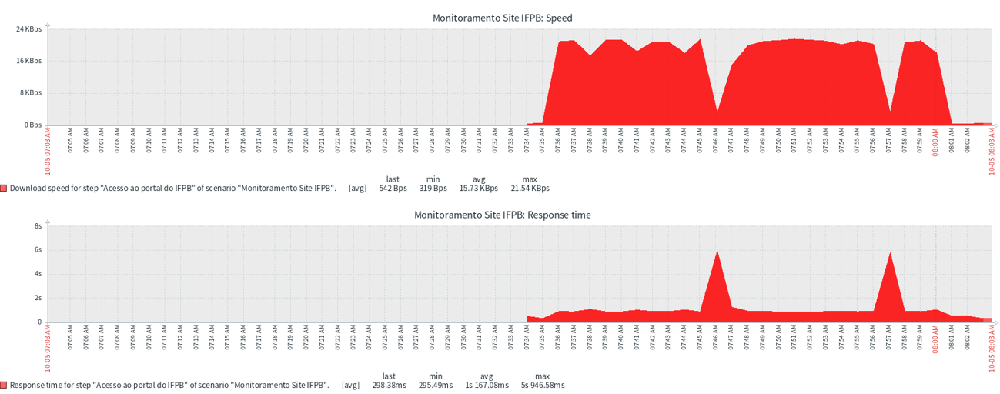
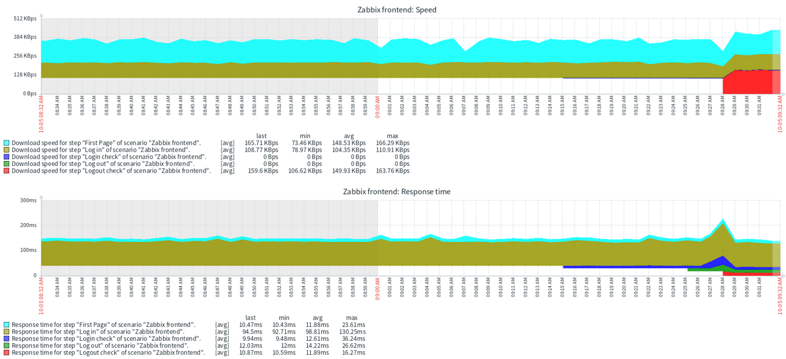

<h1 align="center">Prática 07 - Monitoramento Web - Zabbix</h1>

Para o provisionamento do ambiente, execute o arquivo docker-compose.yml disponível no diretório da prática, usando o comando abaixo:

```bash
$ docker-compose up -d
```
O serviço do Zabbix estará disponível em http://localhost:8080

## 1. Verificando Tempo de Resposta e Velocidade de Acesso a uma Página Web

Antes de começar, faça o login como usuário Admin e senha zabbix. Para criar um novo cenário de monitoramento Web, siga os passos abaixo:

1. Acesse o menu "Configurações" > "Hosts".
2. Encontre o host criado nas práticas anteriores e clique em "Web" (sétima coluna).
3. Clique em "Criar cenário web" no canto superior direito.
4. Na aba "Cenário":
   - Preencha o Nome como "Monitoramento Site IFPB".
   - Em "Nova aplicação", coloque "Web".
   - Os outros campos podem permanecer com os valores padrão.
5. Na aba "Passos":
   - Clique em "Adicionar".
   - Coloque o Nome como "Acesso ao portal do IFPB" e a URL como www.ifpb.edu.br.
   - Defina o tempo limite como 15s e o código de status requerido como 200.
   - Clique em "Adicionar".

Após configurar o cenário, verifique possíveis erros e tire um print da tela.

Para corrigir redirecionamentos automáticos, siga os passos abaixo:

1. Clique no cenário "Monitoramento Site IFPB".
2. Na aba "Passos", clique no passo "Acesso ao portal do IFPB".
3. Marque a opção "Seguir redirecionamentos" e clique em "Atualizar".
4. Clique em "Atualizar" novamente.

Acesse o menu "Monitoramento" > "Hosts", clique em "Web" e visualize o cenário criado. Tire um print da tela com os gráficos de velocidade de acesso e tempo de resposta.

Essas informações ajudam a identificar gargalos no acesso a páginas ou sistemas Web.

## 1.1 Criando uma Trigger

Para criar uma trigger associada ao monitoramento web, siga os passos abaixo:

1. Acesse o menu "Monitoramento" > "Dados recentes".
2. Selecione a Aplicação "Web" no filtro de busca e ative a opção "Mostrar detalhes".
3. Observe as chaves dos itens criados para o monitoramento Web e tire um print da tela.

Crie uma trigger para verificar falhas na coleta usando o item `web.test.fail[Monitoramento Site IFPB]`. Se o valor desse item for igual a 1, ocorreu uma falha no acesso. A trigger deve acionar sempre que o valor mais recente desse item for igual a 1, com severidade "Desastre". Para testar a trigger, modifique a configuração do cenário Web e desabilite a opção "Seguir redirecionamentos". Após criar a trigger, vá em "Monitoramento" > "Incidentes" e tire um print da tela, mostrando a ocorrência do incidente relativo à trigger criada.

## 2. Cenário Real de Monitoração Web

Siga o tutorial oficial do Zabbix disponível em [Zabbix Web Monitoring Example](https://www.zabbix.com/documentation/current/pt/manual/web_monitoring/example). Realize todos os passos do tutorial e tire prints das telas, mostrando que todas as configurações foram realizadas e testadas no Zabbix executando em sua máquina.

<hr>

## 3. Resultados


