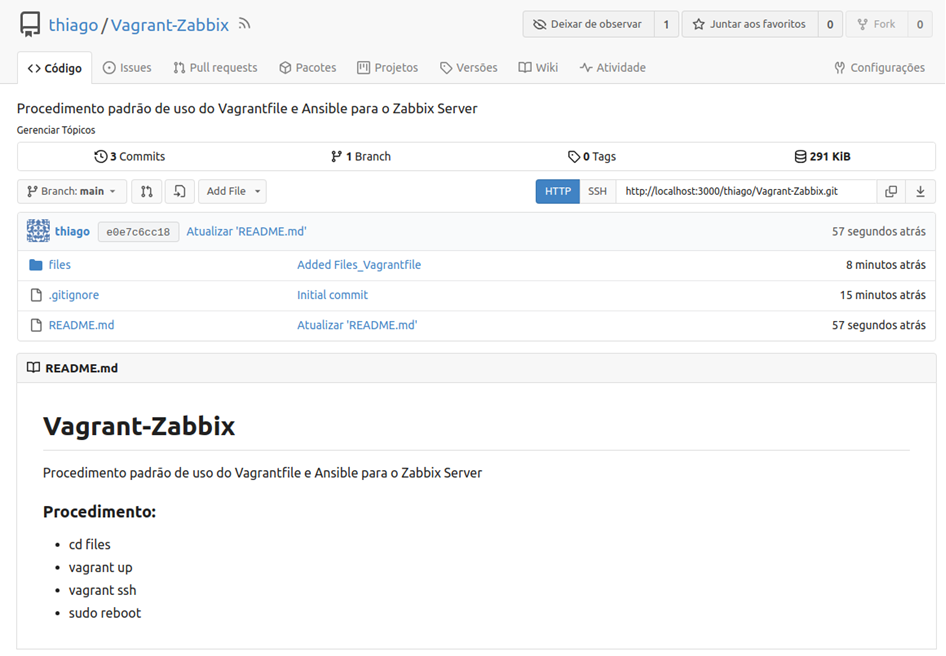

<h2 align="center">Prática 08 - Servidor auto-hospedado de versionamento de códigos GitLab</h2>

<p align="justify"> Instale e configure um servidor próprio de versionamento de códigos GitLab. Este será usado para gerenciamento de configurações. Crie um novo repositório e adicione o Vagrantfile usado para subir uma máquina Zabbix.</p>

<hr>

<p align="justify"> O Gitea é um servidor Git auto-hospedado, rápido e fácil de usar com diversas funcionalidades compartilhadas com BitBucket e GitLab. Escrito em Go, é uma aplicação leve e pode ser instalado em sistemas com baixos requisitos. O objetivo deste projeto é fornecer a maneira mais fácil de estabelecer um serviço Git auto-hospedado (que você pode instalar e gerenciar a partir de sua própria infraestrutura).</p>

<h4 align="justify">Características</p>

<p align="justify"> Gitea é um aplicativo multiplataforma que roda em qualquer sistema operacional, como Windows, MacOS, GNU/Linux, ARM, etc. Além disso, é fácil de instalar, atingindo o objetivo desde os próprios binários até o uso de contêineres Docker. O pacote é leve, por isso não requer muitos recursos, mesmo este pode rodar em um Raspberry Pi barato. Ser open source é o que o torna um software com muito potencial, já que a comunidade está em constante crescimento.</p>

<p align="justify">Além disso, algumas funcionalidades que possui são as seguintes:</p>

- Panel de control de usuario.
  - Capacidade de gerenciar usuários e organizações.
  - Cronograma de atividades como commits , issue , pull requests , criação de repositório e muito mais.
- Panel de issues (problemas).
  - Filtre os problemas como normalmente são: Abertos, Fechados, Seus repositórios, problemas atribuídos e muito mais.
- Painel PR ( Pull Requests ).
- Notificações por e-mail e pelo próprio sistema web.
- Explorador de páginas, usuários, repositórios e organizações.
- Plantillas personalizadas.
- Suporte HTTPS .
- Proteção CSRF e XSS .
- Estabeleça tamanhos e tipos de carga.
- Sistema de registro e inicio de sesión.
- Capacidade de configurar diferentes sistemas de gerenciamento de banco de dados como MySQL, PostgreSQL, SQLite3, MSSQL e TiDB.
- Estatísticas e gerenciamento de usuários.
- Conexão SSH e status do servidor.
- Origens de autenticação como: OAuth , Pam , LDAP e SMTP .
- Monitoramento e muito mais.

Para o provisionamento do ambiente, execute o arquivo docker-compose.yml disponível no diretório da prática, usando o comando abaixo:

```bash
$ docker-compose up -d
$ docker-compose down (para destruir os containers)
```
O servidor estará disponível em http://localhost:3000

## Resultados finais

