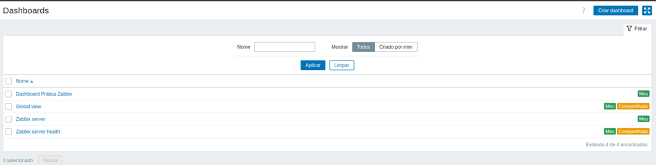
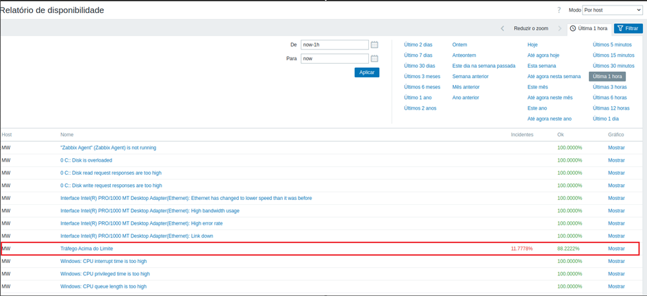

<h1 align="center">Prática 09 - Visualização de Dados - Zabbix</h1>

<h3>1. Visualização de Dados</h3>

Iremos estudar algumas formas de visualização de informações oferecidas pelo Zabbix. Mais especificamente, vamos abordar Dashboards, Mapas e Relatórios.

<h3>1.1	Dashboard</h3>

Por padrão, o Zabbix já possui um Dashboard, que pode ser visto clicando em “Monitoramento” no menu do lado esquerdo e depois em “Dashboard”. Esse dashboard já mostra algumas informações, como informações do sistema, número de hosts e itens sendo monitorados, a disponibilidade dos hosts, o número de problemas separados pela severidade, os incidentes recentes do sistema, mapas e gráficos favoritos. Como um exercício inicial, logue com o usuário Admin e tente identificar todos esses elementos no dashboard padrão.

  

<h3>1.1.1	Criando um Novo Dashboard</h3>

Para criar um novo dashboard, vá em “Monitoramento” e depois clique em “Dashboard”. Após isso, no canto superior direito da tela, clique no botão de opções (ao lado do botão “Editar dashboard”), depois clique em “Criar novo”. Ao criar o novo dashboard, nomeie ele como “Dashboard Prática Zabbix” e coloque o usuário que você criou na prática anterior como dono do dashboard. Após isso, adicione um gráfico com o tráfego da placa de rede, que faz parte do host e do item já criados em práticas anteriores. Para selecionar o host e o item, configure os campos na aba “Conjunto de dados”.
Após adicionar o gráfico, adicione outro Widget contendo uma listagem dos eventos gerados no grupo “Roteiro Prática Zabbix” (criado em uma prática anterior). Para isso, selecione “Incidentes” no tipo do widget e selecione esse grupo no campo “Grupos de hosts”. Tire um print da tela com o dashboard recém criado. Depois clique em “Salvar alterações” no canto superior direito da tela.
Um detalhe importante a salientar é que um usuário só consegue criar dashboards com os hosts e itens que ele tem acesso. Como estamos criando com o super usuário Admin, temos acesso a todos os hosts e itens cadastrados até o momento.
Por fim, faça logout com o usuário Admin e logue novamente com o usuário “normal” que foi criado na prática anterior e que foi cadastrado como dono do novo dashboard criado. Clique em “Monitoramento” e depois em “Dashboard”. Após isso, clique em “Todos os dashboards” no canto superior esquerdo. Selecione o dashboard recém criado e depois o coloque em modo quiosque (botão para entrar em tela cheia, que fico no canto superior direito). Tire print da tela com o dashboard maximizado.

  
  
  
  

<h3> 1.2	Mapas </h3>

Um mapa permite visualizar um conjunto de hosts e a ligação entre eles e é possível também visualizar de forma rápida se existe algum incidente em um host ou na conexão entre dois hosts. O mapa também é uma forma interessante de ter uma visão geral sobre o cenário de monitoramento configurado no Zabbix.

<h3>1.2.1	Criando um mapa </h3>

Logue novamente com o usuário Admin, depois clique em “Monitoramento” e em seguida em “Mapas”. Note que já vai aparecer um mapa, que é criado por padrão, contendo um único host (o Zabbix server). Para adicionar um novo mapa é necessário clicar em “Todos os mapas” no canto superior esquerdo. Após isso, clique em “Criar mapa”, no canto superior direito. No nome do mapa coloque “Mapa Prática Zabbix”. Após criar o novo mapa, clique em “Editar mapa”, no canto superior direito. Inicialmente, vamos adicionar um host referente ao Zabbix server, da mesma forma que aparece no mapa que vem configurado por padrão. Para isso, clique em “Adicionar” no canto superior esquerdo. Depois, clique a figura do host incluído para configurá-lo. Na tela de configuração selecione o Tipo “Host” e no campo do Texto coloque “HOST.NAME - HOST.CONN”, isso vai fazer com que o nome do host e o seu endereço IP sejam mostrados seguindo esse padrão. Após isso, selecione o Host “Zabbix server” e o padrão do ícone “Zabbix_server_3D_(128)”. Clique finalmente em “Aplicar” para concluir a configuração.
Vamos agora adicionar mais um host, o que foi criado nas práticas anteriores e que faz parte do grupo de hosts “Roteiro Prática Zabbix”. Para isso, clique novamente em “Adicionar” e depois clique na figura do host adicionado para configurá-lo. Selecione o tipo “Host” e no texto configure com “HOST.NAME”, depois clique em “Aplicar”. Por fim, clique no botão “Atualizar”, no canto superior direito. Agora clique no mapa recém criado e tire um print. Perceba que os nomes dos hosts aparecem. No host que foi adicionado por último, é para aparecer a palavra “OK” em verde caso nenhum incidente esteja ocorrendo.
Agora crie uma nova trigger chamada “Tráfego Acima do Limite” para o item “Tráfego de entrada” e configure essa trigger para ser acionada se o tráfego ficar maior que 200, com severidade alta (você já deve saber fazer isso, com a experiência de práticas anteriores). Agora faça algo para aumentar o tráfego na sua máquina virtual (ex: comece a baixar algum pacote usando apt-get [ex: apt-get install vlc]). Após fazer isso, aguarde 10 segundos para dar tempo de o item ser atualizado e vá no mapa. Verifique que aparecerá o nome do incidente em vermelho, indicando que a trigger foi acionada para o host. Tire um print mostrando o incidente aparecendo no mapa. Você também pode conferir a ocorrência do incidente no menu “Incidentes”.

  
  
  
  
  
  

<h3>1.3	Relatórios </h3>

O menu “Relatórios” permite obter um conjunto de informações úteis sobre o funcionamento dos hosts. Pode-se verificar o relatório de disponibilidade, os Top 100 triggers o log de ações no Zabbix e as notificações. Clique em “Relatório de disponibilidade”. É possível verificar o percentual de tempo em que um determinado host apresentou algum incidente devido a alguma trigger específica e o percentual de tempo em que o status estava “Ok”. Ao clicar nessa opção deverá aparecer o incidente “Tráfego Acima do Limite”, que foi criado durante essa prática. É possível verificar graficamente a disponibilidade, clicando em “Mostrar”. Faça isso para o incidente “Tráfego Acima do Limite” e tire um print da tela com o gráfico. Perceba que o gráfico mostra para cada dia o percentual do tempo em que o host estava “Ok” e o percentual de tempo em que o incidente ocorreu.

  
  
  

