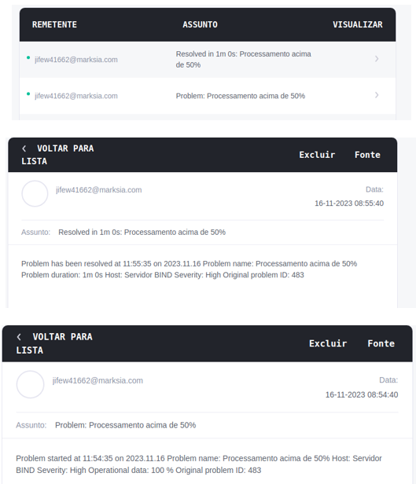
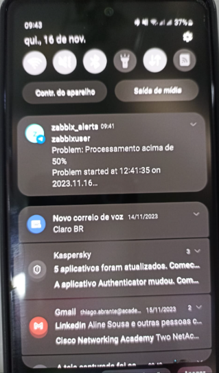

<h1 align="center">Prática 10 - Zabbix 24/7</h1>

<p align="justify">
Não são muitas as empresas que conseguem manter pelo menos um funcionário em seu NOC 24 horas por dia nos 7 dias da semana... =(

Uma das alternativas para lidar com isto, é o sistema de sobre aviso, quando o funcionário é pago apenas para ficar atento ao celular/computador.

Para este sistema funcionar, o Zabbix tem que ser capar de chamar atenção deste(s) funcionários em caso de problemas.

Sua missão é configurar um cenário de gerenciamento de um servidor linux, e configurar avisos quando o processamento atingir certo patamar.

Avisos desejáveis:

* E-mail
* Telegram ou Whatsapp
* Microsoft Teams (?)
</p>

<hr>

Para o provisionamento do Zabbix, execute o arquivo docker-compose.yml disponível no diretório da prática, usando o comando abaixo:

```bash
$ docker-compose up -d
$ docker-compose down (parar os containers)
```
O servidor estará disponível em http://localhost:8080

## Resultados finais


<h3 align="center">Alertas por E-mail</h3>

<br>
<h3 align="center">Alertas por Telegram</h3>

<br><br>
<p align="justify">
<span style="font-size:22px;">Obs.:</span> A solução para o envio de alertas via Microsoft Teams só é possível apenas para o Teams como parte do Office 365, sendo que o plano gratuito do aplicativo não oferece suporte ao recurso de Webhook para integrar o Zabbix ao Microsoft Teams. Fonte: <a href="https://www.zabbix.com/br/integrations/msteams">https://www.zabbix.com/br/integrations/msteams</a>
</p>


