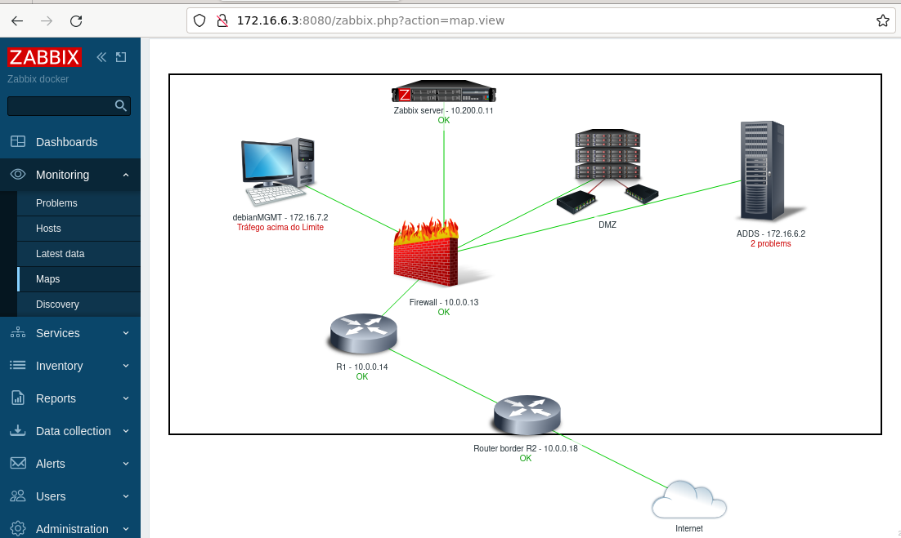
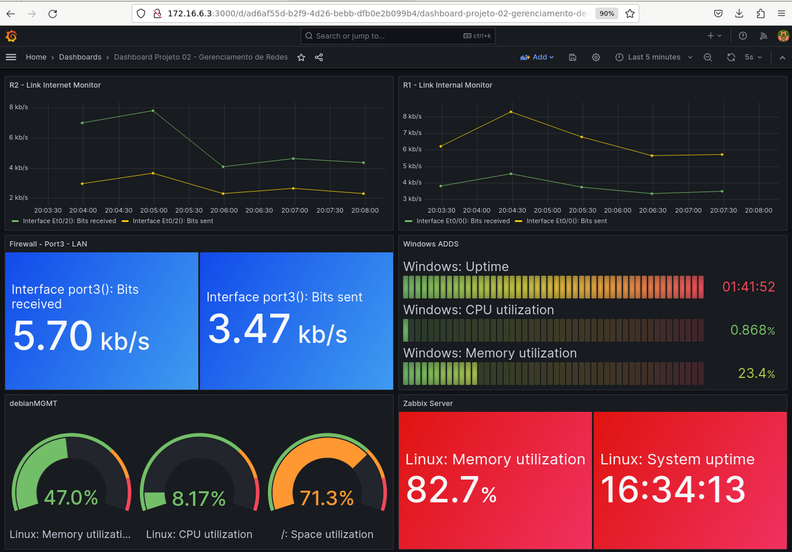

# Projeto - Parte 2 - Gerenciamento de Redes de Computadores

<h3 align="justify">Objetivo: Realizar a implementação do servidor de gerenciamento de redes Zabbix para o cenário do <a href="https://github.com/abrantedevops/Grc-Proj" target="_blank">Projeto 1</a> (Provedor de Internet). Devem ser efetuadas todas as configurações estudadas durante a disciplina: Mapas, dashboards, triggers, alertas, grafana, gitlab, gerenciamento de serviços, etc. A entrega deve ser por Vídeo, ao qual deve exibir o funcionamento do Zabbix. Crie falhas para que o Zabbix detecte o problema em tempo real. </h3>

    
      
    

<h3 id="mais-informações">Mais informações:
<a href="https://www.youtube.com/watch?v=-hWzYjgJ2DU&t=1s" target="_blank">Parte 02 - Topologia lógica Provedor - Monitoramento e Ações</a>
</h3>
